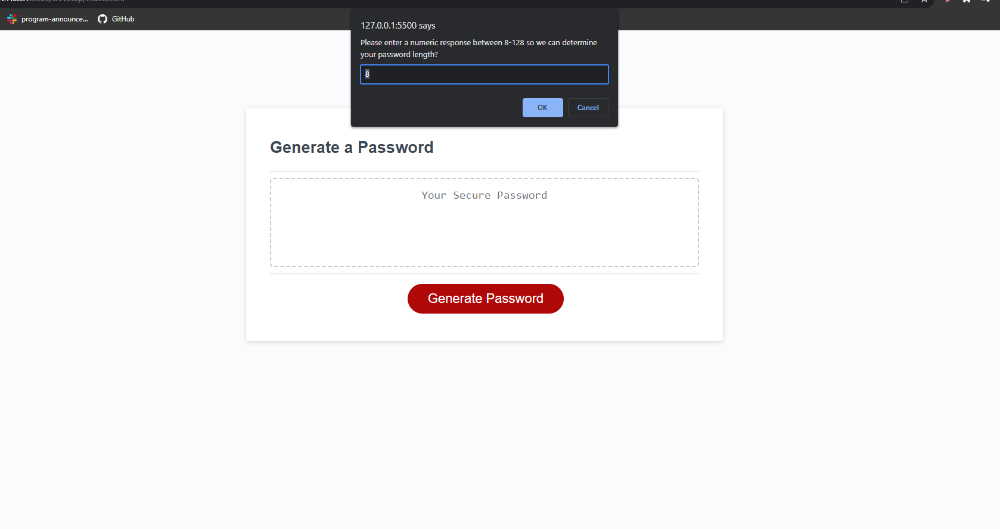

#My Random password generator.

This application creates a password of a certain length with certain characters depending on what characters are chosen from.
We have uppercase, lowercase, numbers, and special characters to choose from. The password length must be between 8-128 characters.
Confirmation windows appear to help you make your character and length selection, then a random password is created using random math functions.

Some of the challenges I faced during this challenge were adding if then statements to my confirmations, setting variables to those confirmations, and allowing those variables to be rewritten depending on the inputs given to the program.

I enjoyed the journey and it was fun to learn just what I can do with variables and functions.

To run this program, simply click the large button and follow the on screen prompts.

CREDITS:
I used this youtube video to help me understand the random math function as well as to be used as a starting point for character randomization.

https://www.youtube.com/watch?v=lZkUdFsulFU&t=484s&ab_channel=MysteryCode

I added my own variables and logic to the code. What I used the video to better explain math functions and randomization in js.

Below is a screenshot of the webpage.

